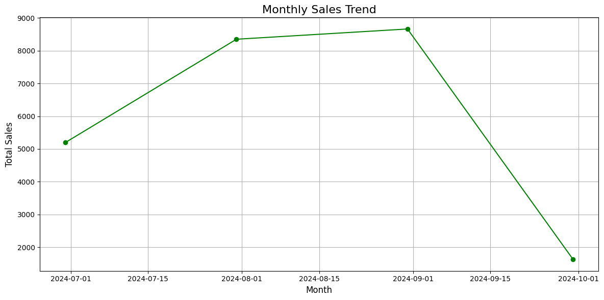
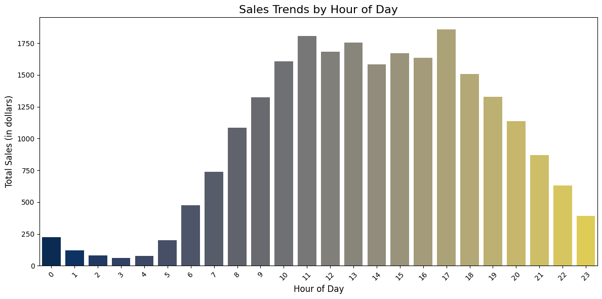
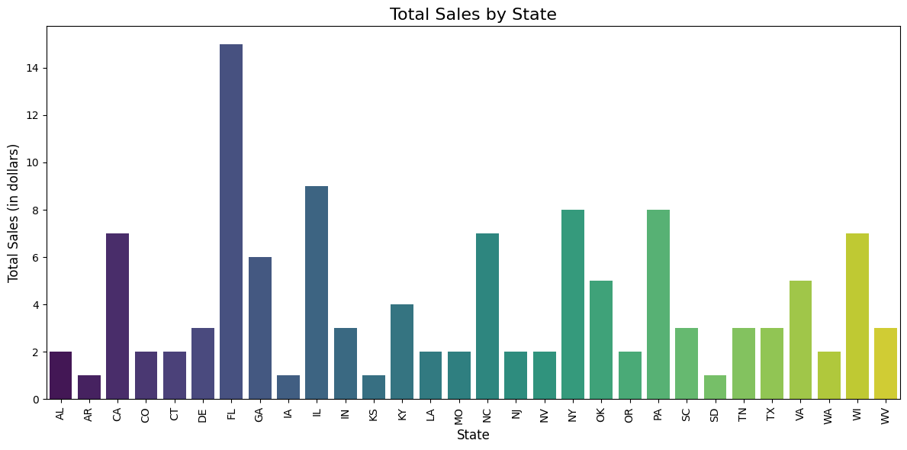
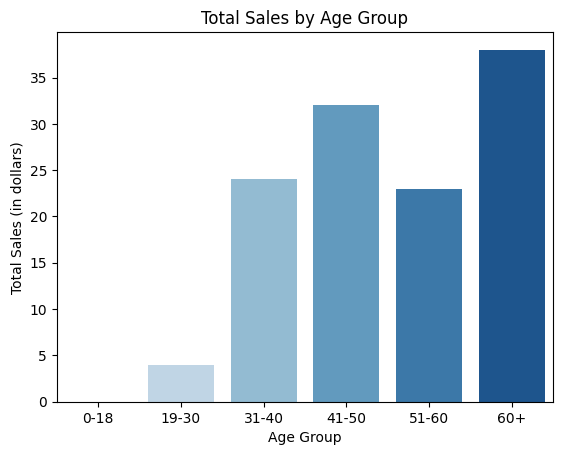
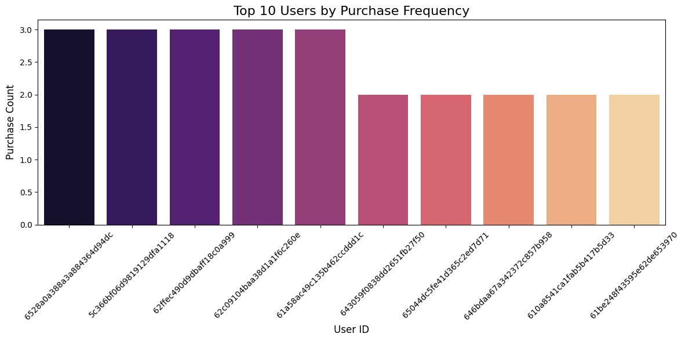

# Data visualizations for data exploration
Assumptions/Data cleaning 
1. Not considering rows from products where barcode is missing
2. Transaction table has multiple entries for same `receipt_id`, `barcode` with different `sale` and `quantity` values. As part of cleaning, I'm merging all rows considering max of `sale` and `quantity` values.

## 1. This is aggregated sale per month. Seems like Sepetember was highest grossing month.

## 2. This is time series graph with aggregated sales per hour 

## 3. This is bar chart graph with aggregated sales per state. 

## 4. This is bar chart graph with aggregated sales by age buckets(10 years). 

## 5. This graph shows top users by purchase frequency.
