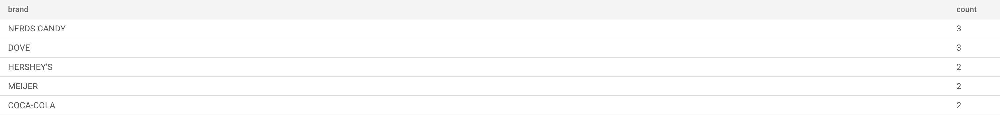
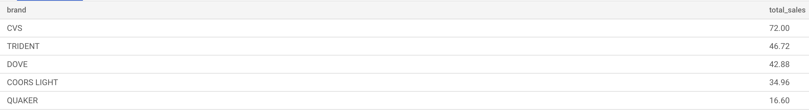
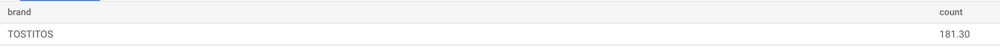

# Closed-ended questions:
## 1. What are the top 5 brands by receipts scanned among users 21 and over?
Assumption/Data cleaning - Not considering rows from products where barcode is missing
```
SELECT p.brand, count(distinct(receipt_id)) as count
FROM
  users AS u
INNER JOIN
  transactions AS t
ON
  u.id=t.user_id
INNER JOIN
products AS p
ON p.barcode = t.barcode
where u.birth_date <= DATE_SUB(CURDATE(), INTERVAL 21 YEAR) and p.barcode!=0 and p.brand!=''
GROUP by p.brand
order by count(distinct(receipt_id)) DESC
LIMIT 5
```


## 2. What are the top 5 brands by sales among users that have had their account for at least six months?
Assumption/Data cleaning - Not considering rows from products where barcode is missing
```
SELECT p.brand,sum(t.sale) as total_sales
FROM
  users AS u
INNER JOIN
  transactions AS t
ON
  u.id=t.user_id
INNER JOIN
  products AS p
ON p.barcode = t.barcode
where u.created_date <= DATE_SUB(CURDATE(), INTERVAL 6 MONTH) and p.brand!='' and p.barcode!=0
GROUP by p.brand
order by sum(t.sale) DESC
LIMIT 5
```


# Open-ended questions:
## 1. Which is the leading brand in the Dips & Salsa category?
Assumption/Data cleaning - Transaction table has multiple entries ffor same `receipt_id`, `barcode` with different `sale` and `quantity` values. As part of cleaning, I'm merging all rows considering avergae  `sale` and `quantity` values
```
SELECT p.brand, sum(t.sale) as count
FROM
  (select receipt_id,purchase_date,scan_date,store_name,user_id,barcode, max(sale) as sale, max(quantity) as quantity from transactions GROUP by receipt_id,purchase_date,scan_date,store_name,user_id,barcode) as t
INNER JOIN
  products AS p
ON p.barcode = t.barcode
where p.barcode!=0 and category_2='Dips & Salsa' and brand!=''
GROUP by p.brand
order by sum(t.sale) DESC
limit 1
```

